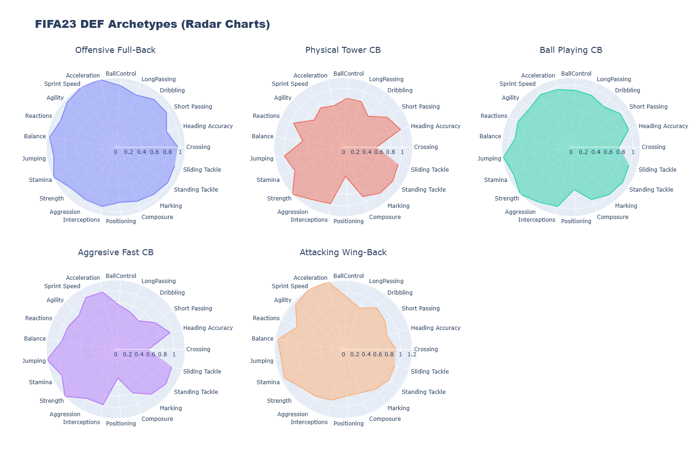

# ⚽ FIFA 23 Player Archetypes

This project analyzes FIFA 23 player data to identify **15 archetypes** (5 for each position group: defenders, midfielders, and forwards) using **KMeans clustering**. The resulting archetypes are visualized with **radar charts** to provide an intuitive understanding of different playing styles.

---

## 📊 Example of Defender Archetypes
Here’s a radar chart showing the 5 archetypes for defenders:

  

---

## 📖 Project Overview

- 📥 **Data Source:** Kaggle [FIFA 23 Players Dataset](https://www.kaggle.com/datasets/sanjeetsinghnaik/fifa-23-players-dataset)
- 🧹 **Data Processing:** Clean and group players by position (DEF, MID, FWD).
- 📊 **Clustering:** Apply KMeans to each group to find archetypes.
- 📈 **Visualization:** Radar charts for each cluster (15 total).

This repository is structured to be modular and easy to use.

---

## 📥 Downloading the Dataset

Due to licensing restrictions, the dataset is **NOT included** in this repository.  

1. Download the dataset from Kaggle:  
   👉 [FIFA 23 Players Dataset](https://www.kaggle.com/datasets/sanjeetsinghnaik/fifa-23-players-dataset)
2. Place the `.csv` file in the `data/` folder and rename it to: 'fifa23.csv'
3. See `data/README.md` for more details.
